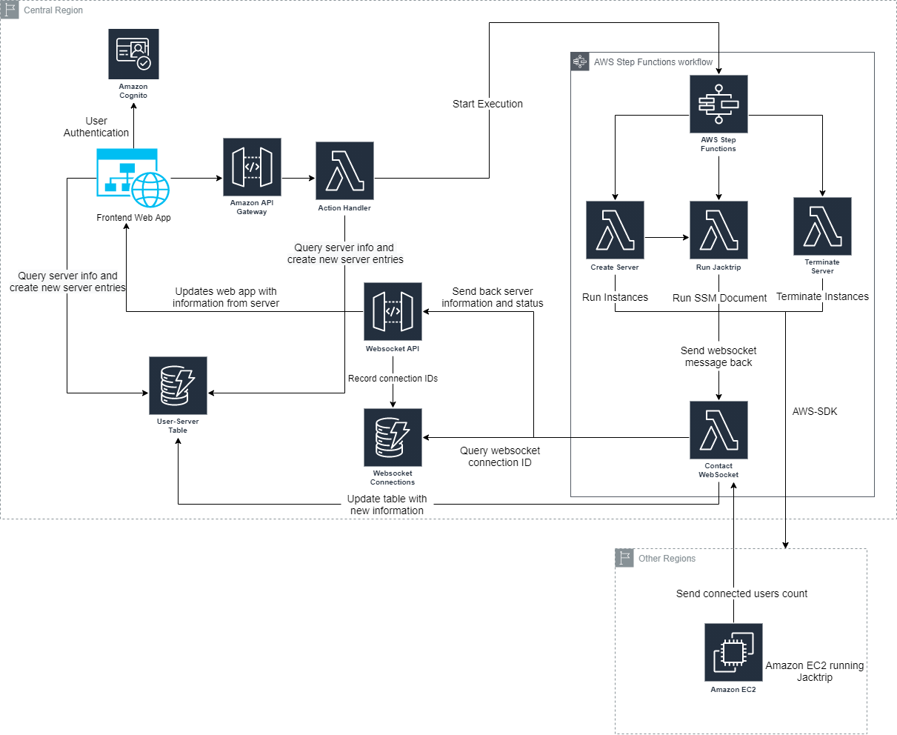
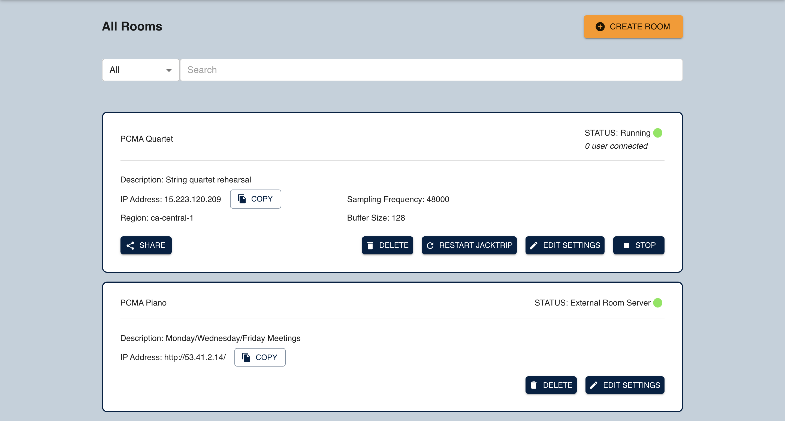
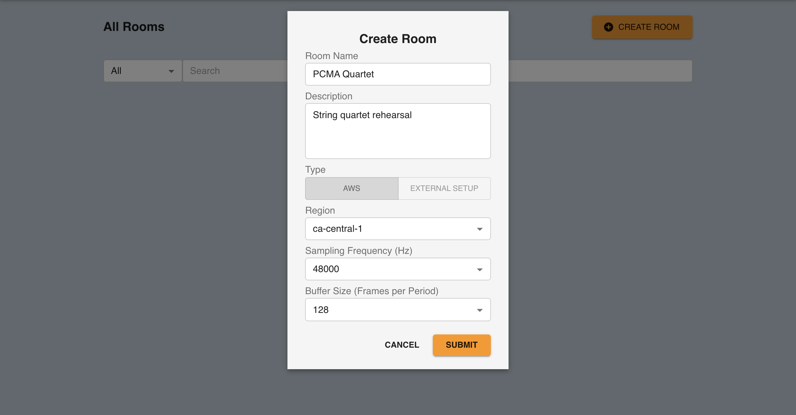
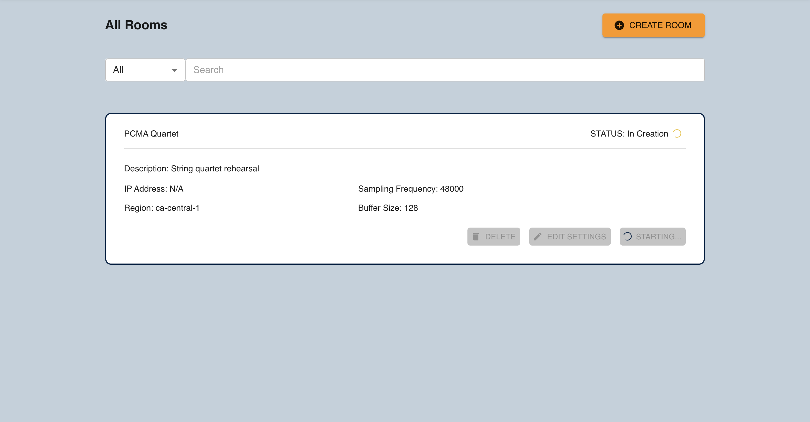
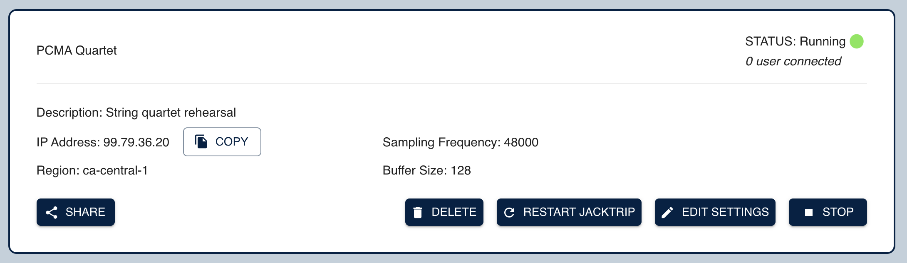
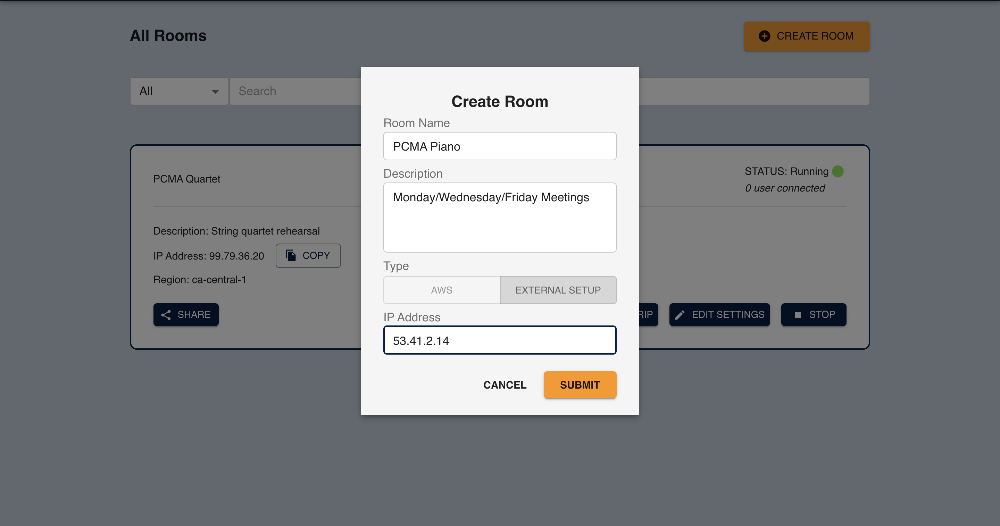
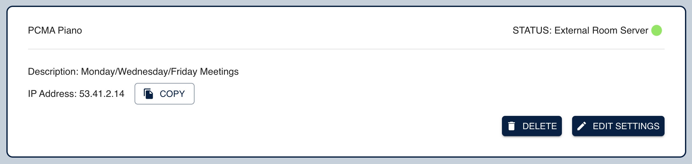
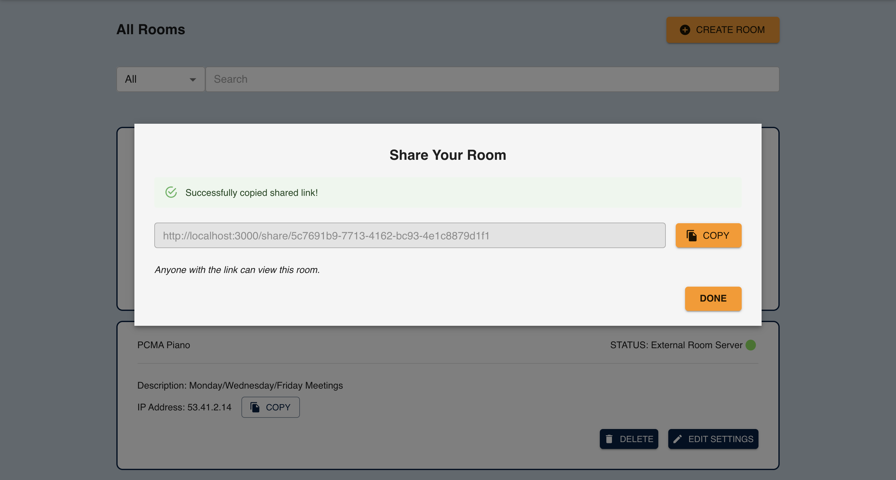
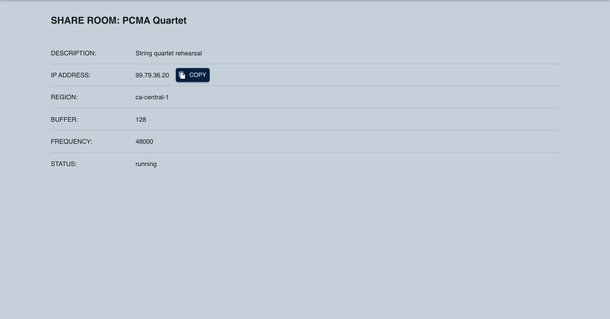

# PMCA-CIC

## Project Overview

This prototype aims to be a user-friendly web portal used to manage [Amazon EC2](https://aws.amazon.com/ec2) instances that is running [Jacktrip](https://ccrma.stanford.edu/software/jacktrip/) Hub Servers in multiple AWS regions.

Users sign up using a secured login through [Amazon Cognito](https://aws.amazon.com/cognito/) into a [ReactJS](https://reactjs.org/)
Progressive Web Application hosted via [AWS Amplify](https://aws.amazon.com/amplify/) (through desktop or mobile).

The backend uses [AWS Lambda](https://aws.amazon.com/lambda/) functions to get data from various categorised data
sources, and persist them into:

-   [Amazon DynamoDB](https://aws.amazon.com/dynamodb/) - for viewing all content from a certain data source

and passes updates of the room, including room status, ip address, and number of user connections to the room server, through the [WebSocket Api](https://docs.aws.amazon.com/apigateway/latest/developerguide/apigateway-websocket-api.html/)'s messsaging protocol.

## Table of Contents

| Index                                               | Description                                    |
| :-------------------------------------------------- | :--------------------------------------------- |
| [High Level Architecture](#high-level-architecture) | Examine the application architecture.          |
| [Application Screenshots](#application-screenshots) | Check out the application's user interface.    |
| [Stack Details](#stack-details)                     | Learn more about each stack of the application |
| [Deployment](#deployment)                           | Learn how to deploy this project yourself.     |
| [Credits](#credits)                                 | Meet the team behind this                      |
| [License](#license)                                 | License details.                               |

## High Level Architecture

<h6 align="center">Architecture Diagram</h6>

## Application Screenshots

<h6 align="center">Application Login Page</h6>

---

<h6 align="center">Main Page after the user logged in with rooms already created</h6>

---

<h6 align="center">Entering details to create a room on the AWS server</h6>

---

<h6 align="center">Room in creation status</h6>

---

<h6 align="center">Status update when the room is successfully created</h6>
Once a room is successfully created, you can either (from right to left)

1. Stop: terminates the room server from running, the IP address would be removed and deleted from the database since the room is not running anymore.

2. Edit settings: edits the current information of the room, including room name, description, frequency, buffer and the region of where the room server is located.

3. Restart jacktrip: restarts the jackstrip server

4. Delete: stops the room server and delete the room information from the database.

5. Share: a link which other guest users can access to see the information and status of the room.

---

<h6 align="center">Creating a room with a Jacktrip Server IP Address</h6>

---

<h6 align="center">Successfully adding an external room into the database</h6>

---

<h6 align="center">A link to share with other people to view the information of the specific room</h6>

---

<h6 align="center">A privately accessed page that shows the information of a specific room</h6>

## Stack Details

-   [Authentication](./docs/AuthenticationArchitecture.md)
-   [Frontend User Interface](./docs/FrontendArchitecture.md)
-   [Backend Data Aggregation](./docs/DataAggregationArchitecture.md)

## Deployment

To deploy this solution into your AWS Account please follow our [Deployment Guide](docs/DeploymentGuide.md)

## Changelog

## Credits

This prototype was architected and developed by Andrew Shieh and Jacqueline Huang, with guidance from the [UBC CIC](https://cic.ubc.ca/)
technical and project management teams.

## License

This project is distributed under the [MIT License](./LICENSE).
