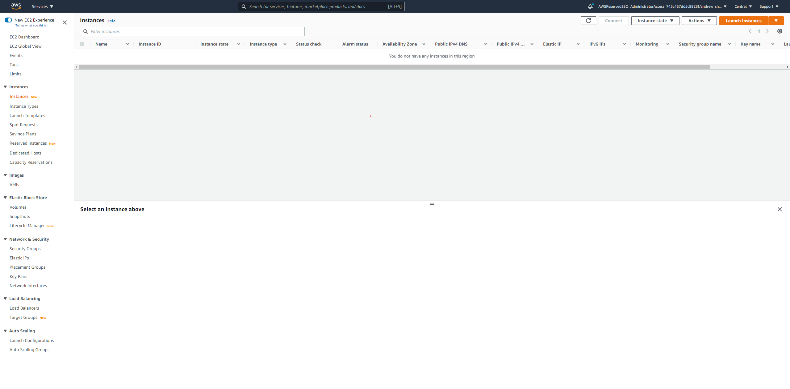

# AMI Setup Guide

This is a guide to setup an [Amazon Machine Image (AMI)](https://docs.aws.amazon.com/AWSEC2/latest/UserGuide/AMIs.html) for running Jacktrip Servers.
This guide will help you create the same AMI we used during the testing of our solution.  
(Note: It is completely possible to use other AMIs to switch the functionality of the solution.)  
If you want to use your own AMI, you can skip to the **Copying the AMI to other regions** step.

## Launching an EC2 instance

First, we will need to create an EC2 instance where we will start creating the AMI.
One way to do this is through the AWS Web Console, go to the EC2 console in your AWS Web Console. It should look like this:

Press the Launch Instances button on the top right of the screen, this will start the instance launch process.

1. First is to select the base AMI of the instance, choose Ubuntu Server 20.04 LTS (HVM), SSD Volume Type, with the x86 version
   
2. Choose t2.micro for the instance type, then click Next
3. Skip this step and click Next.
4. For the storage, we can keep the default value, 8 GB of General Purpose SSD (gp2). Click Next.
5. You can skip adding tags. Click next to configure security group.
6. Configure your security group to allow all traffic in both ingress and egress.
   (CAUTION: This security group rules are very lax and insecure! Do not use this in any instance used in production!)
7. Review your instance configuration and you can press Launch.
8. A window will come up asking you about key pair. This is needed for you to SSH into the EC2 instance. Please create one or use an existing key pair for the instance.  
   If you choose to create one, enter a name for the key pair, make sure to download it and keep it somewhere safe. You can then launch the instance.

## SSH to EC2 instance

Once the instance is launched, connect to it through SSH, there are multiple ways to do this and you are free to choose the ones that are most convenient.  
This is one way to do so in [Windows machines (using PuTTY).](https://docs.aws.amazon.com/AWSEC2/latest/UserGuide/putty.html)

Run these commands in your EC2 instance (press Yes for all options):

```bash
  sudo apt-get update
  sudo apt-get install wget
  sudo apt-get install unzip
  sudo apt-get install qjackctl
  sudo apt-get install jackd -y
  wget https://github.com/jacktrip/jacktrip/releases/download/v1.4.0-rc.3/JackTrip-v1.4.0-rc.3-Linux-x64-binary.zip
  unzip JackTrip-v1.4.0-rc.3-Linux-x64-binary.zip
  sudo apt-get upgrade -y
```

Test that Jacktrip is installed and in the correct version

```bash
  ./jacktrip -v
```

This should be printed:

```bash
  JackTrip VERSION: 1.4.0-rc.2
  Copyright (c) 2008-2020 Juan-Pablo Caceres, Chris Chafe.
  SoundWIRE group at CCRMA, Stanford University
```

### Users Connected Count

In order for the users connected count to function properly, there must be a script that counts the number of users connected and send that information to the ContactWebSocket Lambda. Then we can add a cronjob that runs the script periodically. This is what we have done during our prototyping:

-   Create a shell script file just like in the home directory [status.sh](../status.sh).
-   Create a cronjob by running
    ```bash
    crontab -e
    ```
-   In the file, add this line to execute [status.sh](../status.sh) every minute
    ```bash
    * * * * * ./status.sh
    ```

### Creating the AMI

You can close your SSH connection now. Go back to the EC2 web console, right-click the instance that you just made, go to Image and templates -> Create image.  
Enter the image name (can be anything) and keep everything else as is, then press Create image.

### Copying the AMI to other regions

AMIs are tied to the AWS region they are created in. Thus, we would need to copy the AMI we just made to all the other regions our solution is deployed into.  
To do this, in the EC2 web console go to Images -> AMI on the sidebar. Find and right-click the AMI, then select Copy AMI. Select the destination region and you can keep everything else as is.

Or you can use AWS CLI:

```bash
	aws ec2 copy-image --source-image-id SOURCE_AMI_ID --source-region SOURCE_REGION --name NEW_NAME --region NEW_REGION
```

### Creating SSM parameters

In order for the solution to use the correct AMI, we would need to create a SSM parameter called **_/STACK_NAME/AMIId_** (STACK_NAME must be the same with the name of the backend Cloudformation stack), containing the AMI ID. A SSM parameter is needed for every copy of the AMI in all the regions.  
You can use the [web console](https://docs.aws.amazon.com/systems-manager/latest/userguide/parameter-create-console.html)  
Or the CLI:

```bash
	aws ssm put-parameter --name JacktripAMIId --value AMI_ID --type String --region REGION --overwrite
```

After the AMI is created you can terminate the EC2 instance that you used to create the AMI.
