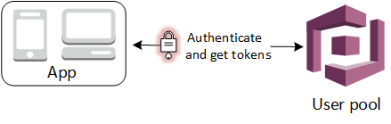

# Authentication Architecture

Amazon Cognito user pools and identity pools which have predefined roles and policies allow guest users and authenticated users to access the AWS services that are used in the Web App.

## What is Amazon Cognito User Pools and Identity Pools?

In short,

    User pools are for authentication (identify verification). With a user pool, your app users can sign in through the user pool or federate through a third-party identity provider (IdP).

    Identity pools are for authorization (access control). You can use identity pools to create unique identities for users and give them access to other AWS services.

*Taken from [What's the difference between Amazon Cognito user pools and identity pools?](https://aws.amazon.com/premiumsupport/knowledge-center/cognito-user-pools-identity-pools/)*

In our case, user pools are used to allow authenticated users to perform actions on room servers, including create, edit, delete, and query rooms. 

Id tokens which are unique to each authenticated users, are also taken to allow access to the [WebSocket Api](https://docs.aws.amazon.com/apigateway/latest/developerguide/apigateway-websocket-api.html/) to receive WebSocket messages that contain room updates from the back-end server. 

The diagram below was taken from the [**Developer Guide of AWS Cognito service**](https://docs.aws.amazon.com/cognito/latest/developerguide/amazon-cognito-user-pools-using-tokens-with-identity-providers.html)

Besides the use cases for authenticated users mentioned above, unauthenticated guest user access is also needed to grant permissions to query the room info in the Shared Room Page; user pools do not allow unauthenticated users to access AWS services, and thus the use of identity pools.

## Log-in authentication

The front-end authentication page is connected with Cognito. The app can handle all the 
sign-in, sign-up, sign-out requests.

Once the deployment of the backend and frontend of this app is finished, to access user pools and identity pools, please head to
[**Cognito**](https://console.aws.amazon.com/cognito/home).

### Access User Pools
1. Click on 'Manage User Pools'
2. Select the User Pool which the web-app is using

### Access Identity Pools
1. Click on 'Manage Identity Pools'
2. Select the Identity Pool which the web-app is using

## How to retrieve ID tokens

There are a few ways in which one can retrieve the ID tokens, one way is the following:

1. Once the user has logged in, you can retrieve all the attributes and jwt token by importing Auth package from Amplify,

`import { Auth } from 'aws-amplify';`

2. Call `Auth.currentAuthenticatedUser().getSignInUserSession().getIdToken().getJwtToken()` to the JWT ID Token