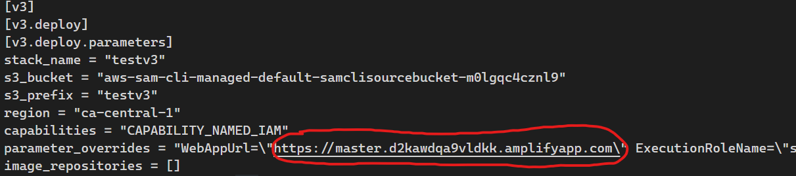
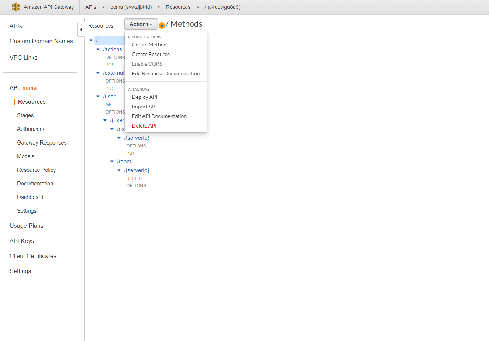

# Deployment Guide

To deploy this solution deploy the **backend** first then, the **frontend**

## Backend Deployment

Some system installation requirements before starting deployment:

-   Have a copy of the repository downloaded into your local machine that you are running the deployment from
-   AWS SAM installed and setup for use on your system, details on the installation can be found
    [here](https://docs.aws.amazon.com/serverless-application-model/latest/developerguide/serverless-sam-cli-install.html).
    (NOTE: The third step of installing Docker is only needed for testing the lambda functions in this app locally, it
    does not have to be installed for the sole purpose of deployment)
-   AWS CLI installed for use on your system, details on the installation can be found [here](https://aws.amazon.com/cli/)

### Deployment Steps

1. You will need to create two IAM roles in order to create a StackSet which we are using in this solution.
   Following official [AWS instructions](https://docs.aws.amazon.com/AWSCloudFormation/latest/UserGuide/stacksets-prereqs-self-managed.html) with their provided yaml files:  
   Please run this command to create an IAM role named AWSCloudFormationStackSetAdministrationRole.
   (This exact role with the same name and permissions needs to exist in your AWS account).
    ```bash
     aws cloudformation deploy --stack-name stack-name-here \
     --template-file AWSCloudFormationStackSetAdministrationRole.yml --capabilities CAPABILITY_NAMED_IAM
    ```
    Then you will need to create a service role named AWSCloudFormationStackSetExecutionRole that trusts the administrator account.
    Please run this command while inserting your own AWS Account ID:
    ```bash
    aws cloudformation deploy --stack-name stackset-target-execution-role --template-file AWSCloudFormationStackSetExecutionRole.yml \
    --capabilities CAPABILITY_NAMED_IAM --parameter-overrides AdministratorAccountId=YOUR_AWS_ACCOUNT_ID
    ```

<!-- 2. Create an S3 bucket (or use an existing one) to hold the regional.yaml file. This can be achieved using the [AWS web console](https://aws.amazon.com),
   or running this command:

```bash
  aws s3api create-bucket --bucket bucket-name --region region \
  --create-bucket-configuration LocationConstraint=region
```

Make sure your bucket is in the same region where you are going to deploy the solution to. You can also use an existing S3 bucket, just make sure to have the appropiate permissions.

3. Upload the regional.yaml file to the S3 bucket. You can use the web console or run this command from the root of the repository.

```bash
  aws s3api put-object --bucket bucket-name --key regional.yaml --body regional.yaml
```

Take note of the URL your uploaded file is assigned to.
For example https://jacktriptestsourcebucket.s3.ca-central-1.amazonaws.com/regional.yaml -->

2. Run this command to deploy the solution.

```bash
sam build --template-file global.yaml \
&& sam deploy -g --capabilities CAPABILITY_NAMED_IAM
```

This will show a prompt where you enter parameters for the Cloudformation Stack, here are the details of the parameters:

-   Stack Name: Put your desired stack name here
-   AWS Region: Put the region where you want the solution to be deployed. This should be the same region where your frontend will be deployed.
-   WebAppUrl: Put the URL of the frontend here (for CORS). Since we are deploying the backend before the frontend, leave this empty for now.
-   DeployedRegion: Put the regions you want to deploy Jacktrip servers to. Write the regions separated by comma.
-   ExecutionRoleName: If your StackSet execution role name is different from the default one, please insert it here, otherwise you can keep the default value.
-   For the rest of the options below, you can press ENTER and use the default value.

```bash
Configuring SAM deploy
======================

        Looking for config file [samconfig.toml] :  Not found

        Setting default arguments for 'sam deploy'
        =========================================
        Stack Name [sam-app]: yourstackname
        AWS Region [us-east-1]:
        Parameter WebAppUrl [*]:
        Parameter ExecutionRoleName [AWSCloudFormationStackSetExecutionRole]:
        Parameter DeployedRegion [ca-central-1, us-west-2]:
        #Shows you resources changes to be deployed and require a 'Y' to initiate deploy
        Confirm changes before deploy [y/N]:
        #SAM needs permission to be able to create roles to connect to the resources in your template
        Allow SAM CLI IAM role creation [Y/n]:
        Save arguments to configuration file [Y/n]:
        SAM configuration file [samconfig.toml]:
        SAM configuration environment [default]:
```

3. Follow this [guide](AMISetup.md) to setup the AMI that the EC2 instance will run.

## Frontend Deployment

### Requirements

Before you deploy, you must have the following in place:

-   [AWS Account](https://aws.amazon.com/account/)
-   [GitHub Account](https://github.com/)

### Steps

In this step we will use the Amplify console to deploy and build the front-end application automatically.

[](https://console.aws.amazon.com/amplify/home#/deploy?repo=https://github.com/UBC-CIC/EC2Ensemble/tree/master)

1. Use the provided **1-click deployment** button below.
2. Select **Connect to GitHub**, and then you will be asked to connect to your GitHub account. Amplify Console will fork this repository into your GitHub account before deploying.
3. Select your AWS service role in the dropdown. If you don't have one configured, Select 'Create new role' and quickly create one using the default settings.
4. At the bottom of the page, click on the triangle button beside Environment variables to expand the Environment variables view.
    - Under **Key**, enter USER_GLOBAL_STACKNAME;
    - Under **Value**, enter the custom stack name you chose in the backend deployment.


5. Click **Save and Deploy**, and wait for deployment to complete in the Amplify console. This may take some time to complete.

### Logging in

Cognito is used for user authentication. Users will need to input their email address and a password to create an account.
After account creation, users will need to verify their account by inputting the 6-digit verification code that was sent to their provided email address before being able to log in to the system.

## Re-deploying backend with WebAppUrl

The default CORS Allow-Origin is set to '\*', you will need to change this to the deployed frontend URL. This is done by changing the WebAppUrl parameter in the sam deploy process.  
(Note: You need to remove the trailing slash from the URL, for example https://master.abcdefghi.amplifyapp.com)

-   If you saved your deployment parameters in a toml file, you can go and modify the parameter in the toml file itself.  
    

-   You can also call sam deploy in the guided mode (-g) again and change the parameters there.
-   Or use:

```bash
	sam deploy --config-env YOUR_CONFIG_ENV --parameter-overrides WebAppUrl=http://your-url-here
```

After the stack update is completed, you will need to redeploy the API. Go to your API settings in the web console, go to the Resources tab, click Action -> Deploy API.  
Select Prod as the Deployment Stage and click Deploy. The API will be re-deployed with the updated CORS settings (may take a few minutes).

